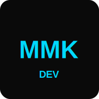

  

<h1 align="center">Hey there! 👋 I'm Mohammad Mehdi Karbalei (MMK)</h1>

<h2 align="center">🚀 Frontend Developer | 🎨 UI/UX Enthusiast | 💡 Open to Collaboration</h2>

---

## 📌 About Me  
- 💻 I'm a **passionate Frontend Developer** specializing in **React, Next.js, and modern UI/UX design**.  
- 🎨 I love transforming creative ideas into **smooth, functional, and visually appealing** web applications.  
- 📌 My focus is on **performance, accessibility, and stunning UI experiences**.  
- 🤝 Always open to **collaborating** on exciting projects!  

---

## 🛠️ Tech Stack

  

---

## 📊 My GitHub Stats  

  

---

## 🌍 Connect with Me  

  
    

  
      
  

